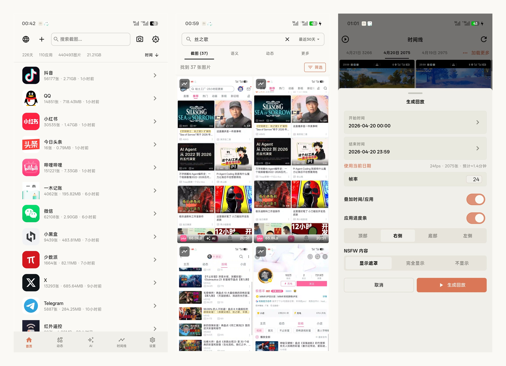
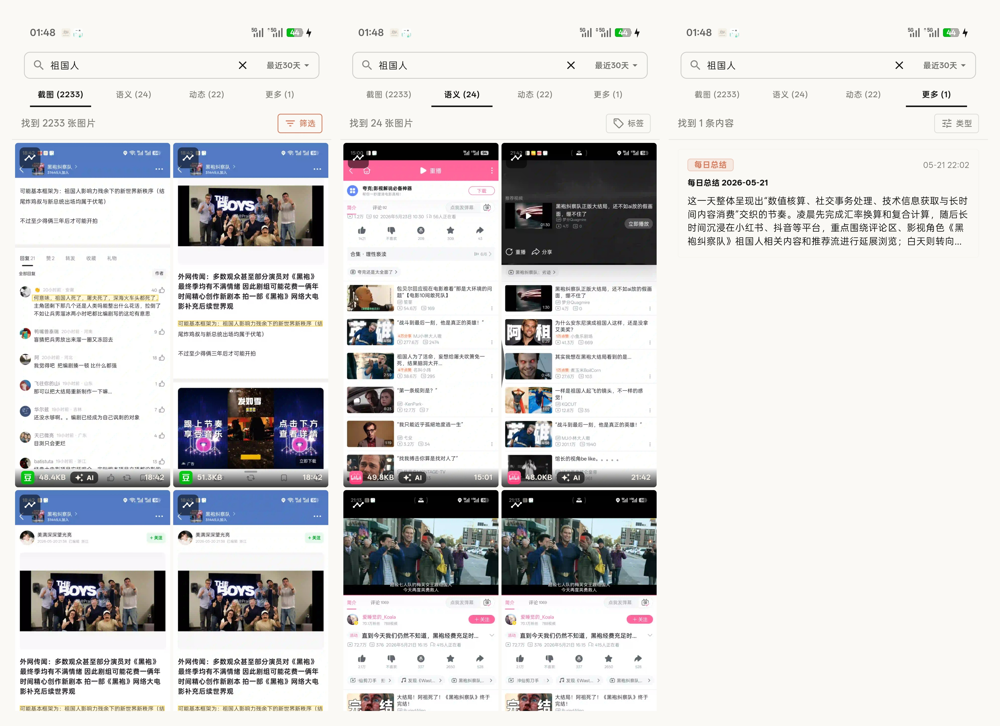
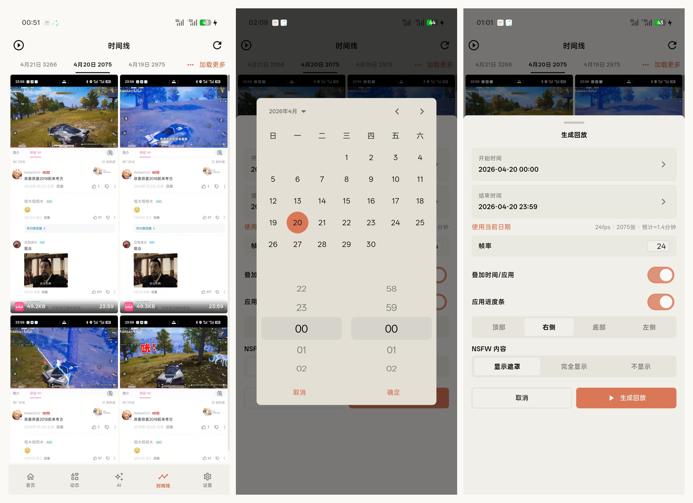
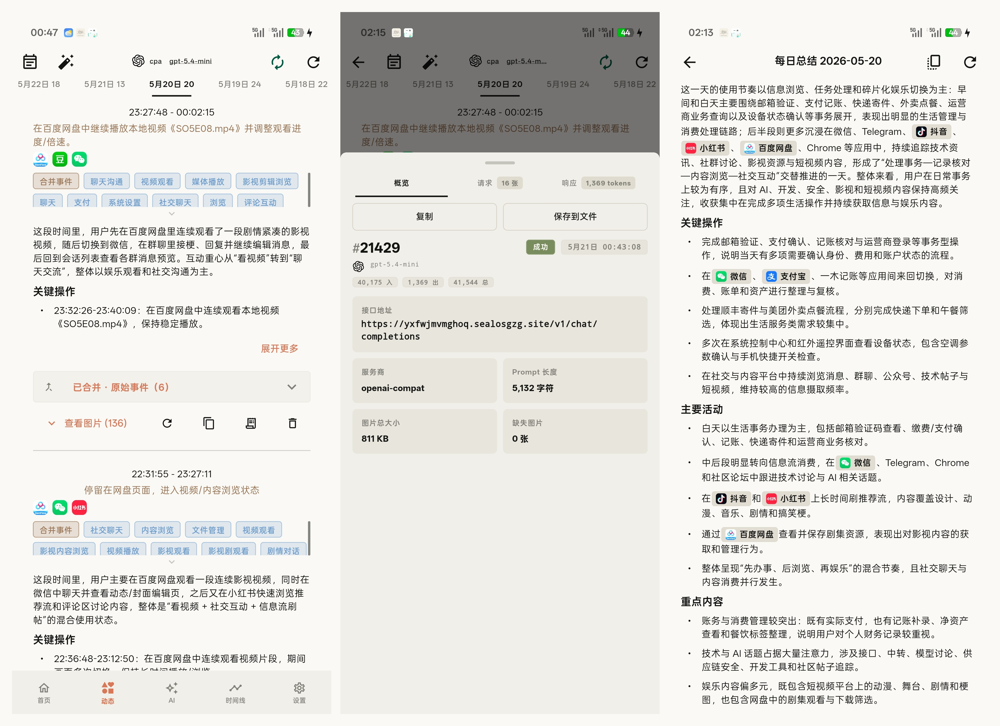
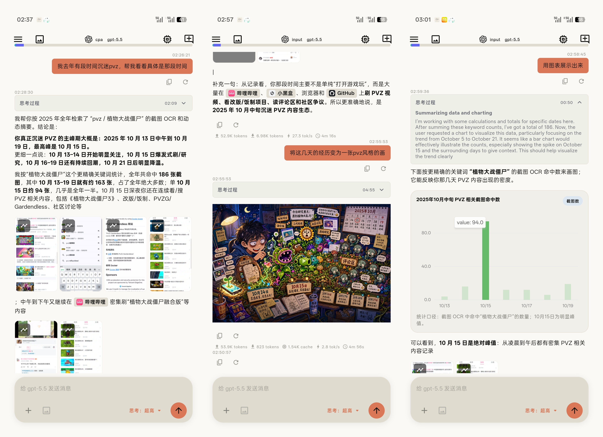
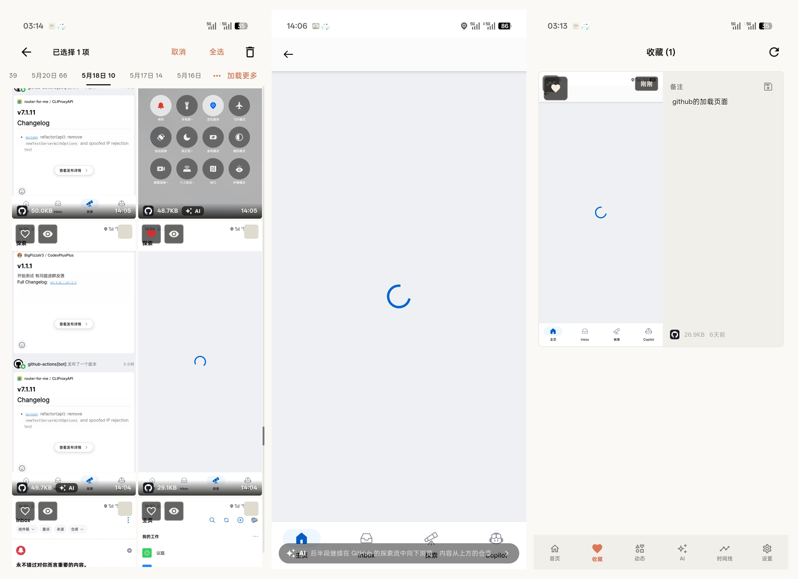
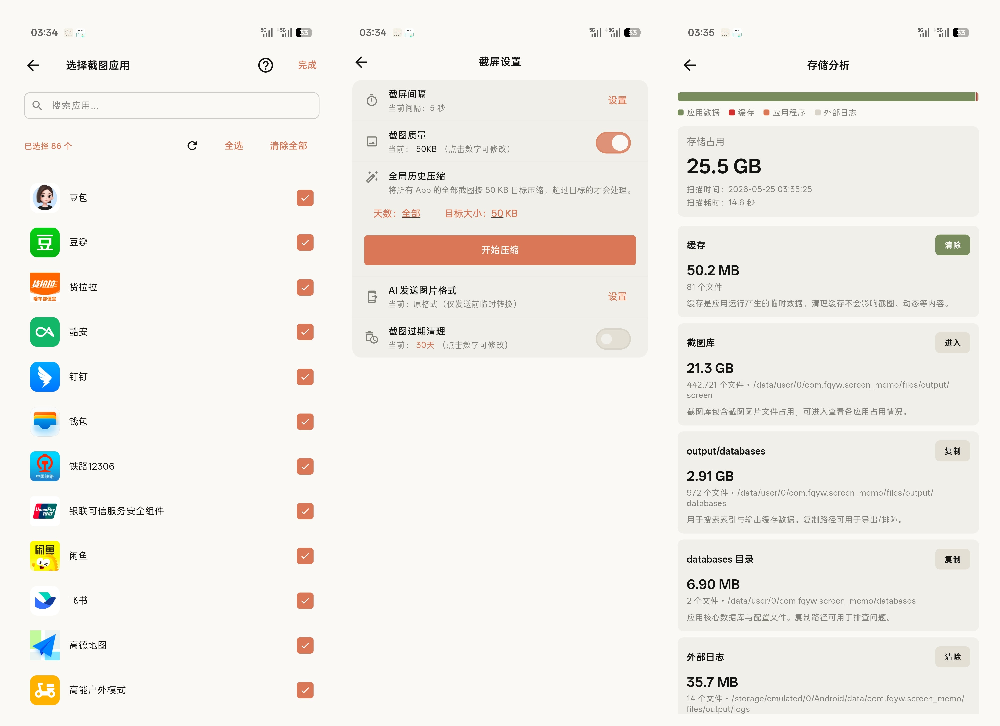
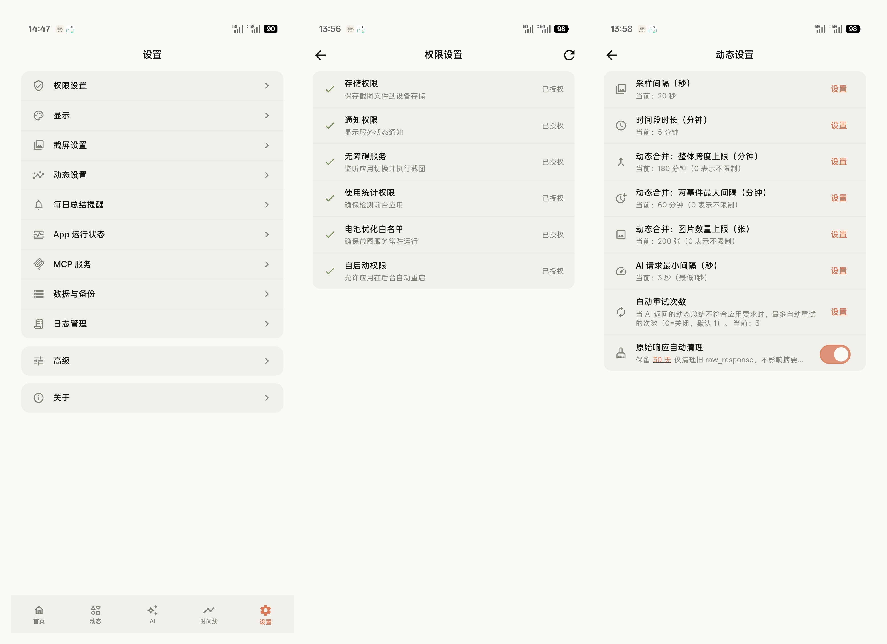
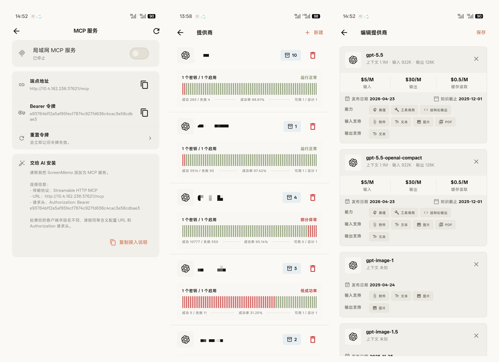
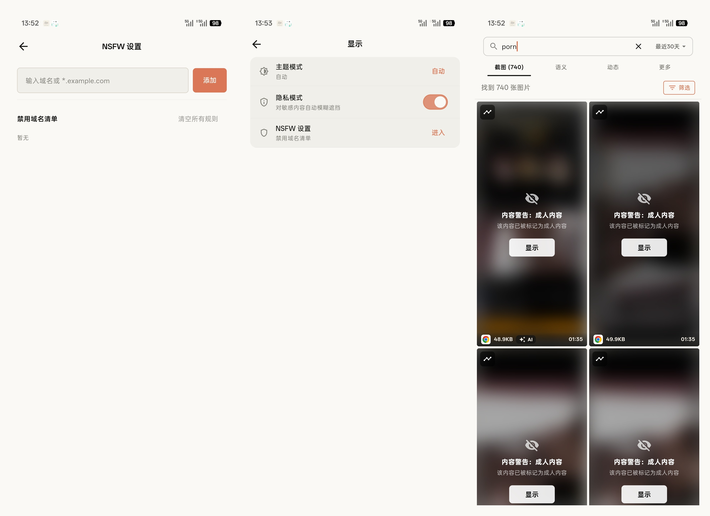

<div align="center">


# ScreenMemo

Local-first smart screenshot memo and retrieval for Android: automatic capture, OCR, and AI-assisted search and review.

"Trace-free screen, traceable memory"

[](https://dart.dev) [](https://www.android.com) [](LICENSE) [](https://qm.qq.com/q/ob2NMRDzna) [](https://github.com/2977094657/ScreenMemo/releases)

</div>

<p align="center">
  <b>Languages</b>:
  <a href="README.md">简体中文</a> |
  English |
  <a href="README.ja.md">日本語</a> |
  <a href="README.ko.md">한국어</a>
</p>

---

## Project Overview

ScreenMemo is a local-first smart screenshot memo and retrieval tool. It automatically records what appears on your Android screen, then uses OCR and an AI assistant to make it searchable so you can quickly recover clues and restore context later.

### Start Building Your Personal Digital Memory Today

**Why start now?**

- **Irreversible knowledge loss**: As more people begin feeding their personal AI with everyday data, every unrecorded day leaves your future AI assistant with a little less grounding to truly understand you.
- **The quiet compounding power of time**: Data cannot be crammed at the last minute. People who start preserving digital specimens today will naturally own a personal memory vault that others will struggle to catch up with when AI reaches its next leap.
- **Recover your scattered digital self**: Your most valuable context is often fragmented across different apps and devices. Without ScreenMemo to preserve it, much of it will fade with time and become difficult to fully awaken again.

## Screenshots

The screenshots below are grouped by feature theme. Each image shows a complete usage scenario.

<table>
  <tr>
    <td align="center" valign="top">
      
      <div align="center"><sub>Core entry points: capture, search, and timeline</sub></div>
    </td>
    <td align="center" valign="top">
      
      <div align="center"><sub>Search and result summaries</sub></div>
    </td>
  </tr>
  <tr>
    <td align="center" valign="top">
      
      <div align="center"><sub>Timeline, calendar, and replay generation</sub></div>
    </td>
    <td align="center" valign="top">
      
      <div align="center"><sub>AI review, daily summary, and request logs</sub></div>
    </td>
  </tr>
  <tr>
    <td align="center" valign="top">
      
      <div align="center"><sub>AI memory search and charting</sub></div>
    </td>
    <td align="center" valign="top">
      
      <div align="center"><sub>Favorites, loading states, and notes</sub></div>
    </td>
  </tr>
  <tr>
    <td align="center" valign="top">
      
      <div align="center"><sub>Capture settings, compression, and storage analysis</sub></div>
    </td>
    <td align="center" valign="top">
      
      <div align="center"><sub>Settings, permissions, and dynamic tasks</sub></div>
    </td>
  </tr>
  <tr>
    <td align="center" valign="top">
      
      <div align="center"><sub>MCP service, AI providers, and semantic models</sub></div>
    </td>
    <td align="center" valign="top">
      
      <div align="center"><sub>Privacy mode and sensitive-content controls</sub></div>
    </td>
  </tr>
</table>

## Quick Start

### Regular users: download the APK installer

If you just want to use ScreenMemo on your phone, install the prebuilt APK from GitHub Releases. You do not need Flutter, Android Studio, or a local source build.

1. Open [GitHub Releases](https://github.com/2977094657/ScreenMemo/releases) and go to the latest version.
2. In **Assets**, download the `screen_memo-...-app-*-release.apk` package that matches your phone. Most modern Android phones should use `arm64-v8a`; if you are not sure, ask in the community chat with your phone model.
3. Move the APK to your phone and install it. If Android warns about "unknown sources" or installation risk, make sure the file came from this project's Releases page, then allow your browser or file manager to install unknown apps.
4. On first launch, follow the in-app prompts to grant required permissions. Automatic capture requires Android 11 (API 30)+, and Accessibility, Usage Access, and battery-optimization exemption are recommended.

### Developers: run from source

#### Requirements

- **Flutter SDK**: `3.35.7` (current CI-verified version)
- **Dart SDK**: `3.9.2` (bundled with Flutter `3.35.7`; the project constraint is `>=3.8.1`)
- **JDK**: `17` recommended (CI uses `17`; Android source / target compatibility still emits Java 11 bytecode)
- **Android SDK**: the release workflow uses `Platform 36`, `Build-Tools 36.0.0`, and `NDK 27.0.12077973`
- **Current APK build config**: `minSdk 24`, `targetSdk 36`
- **Main feature platform requirement**: automatic capture requires Android 11 (API 30)+
- **IDE**: Android Studio / VS Code with the Flutter plugin

#### Install and Run

1. **Clone the repo**
   ```bash
   git clone <repository-url>
   cd screen_memo
   ```

2. **Install dependencies**
   ```bash
   flutter pub get
   ```

3. **Generate localization code**
   ```bash
   flutter gen-l10n
   ```

4. **Run the app**
   ```bash
   flutter run
   ```

#### Test with an Android Emulator

1. Create an Android 11+ AVD in Android Studio **Device Manager**
2. Start the emulator, then run:
   ```bash
   flutter emulators
   flutter devices
   flutter run -d <device_id>
   ```

More maintainer development notes are available in [`docs/DEVELOPMENT.md`](docs/DEVELOPMENT.md).

#### Development and Verification Commands

```bash
# Static analysis
flutter analyze

# Flutter tests
flutter test

# i18n audit
dart run tool/i18n_audit.dart --check

# Debug APK
flutter build apk --debug

# Release APKs (split per ABI)
flutter build apk --release --split-per-abi --tree-shake-icons --obfuscate --split-debug-info=build/symbols
```

#### Feature Tests and Regression Protection

Android JVM unit tests:

**Windows**
```powershell
cd android
.\gradlew.bat test
```

**macOS / Linux**
```bash
cd android
./gradlew test
```

## MCP Service

ScreenMemo can manually start a read-only LAN MCP service on the phone, allowing AI clients on the same local network to read activity summaries, search results, context snippets, and a small number of explicitly requested evidence images.

- Enable the LAN MCP service manually in the Android app under "Settings -> MCP Service".
- The endpoint is fixed at `http://<phone-lan-ip>:37621/mcp`, and requests must include `Authorization: Bearer <token>`.
- Standard MCP clients should use `tools/list` to discover tools and `tools/call` to invoke them. For compatibility with some clients, declared tool names can also be called directly as JSON-RPC `method` values.
- OCR text and image base64 are not returned by default. Sensitive content is only returned when tool parameters explicitly enable `include_ocr`, or when calling `get_evidence_images`, with quantity and length limits.
- If port `37621` is occupied, the settings page shows a startup error and does not automatically switch to a random port.

## Support the Project

If ScreenMemo has helped you recover important clues, you are welcome to support the author.

<div align="center">
  <table>
    <tr>
      <td align="center" valign="top">
        
        <div align="center"><sub>WeChat</sub></div>
      </td>
      <td align="center" valign="top">
        
        <div align="center"><sub>Alipay</sub></div>
      </td>
    </tr>
  </table>
</div>

## Community Chat

<div align="center">
  <table>
    <tr>
      <td align="center" valign="top">
        <a href="https://qm.qq.com/q/ob2NMRDzna">
          
        </a>
        <div align="center"><sub>QQ Group: 640740880</sub></div>
        <div align="center"><sub><a href="https://qm.qq.com/q/ob2NMRDzna">Join the ScreenMemo group chat</a></sub></div>
      </td>
    </tr>
  </table>
</div>

## FAQ

<details>
<summary>How much storage does it take per month?</summary>

- Example: if your compressed image size is about 50 KB and you capture one screenshot per minute, 30 days is about 43,200 images, or roughly 2.1 GB / month
- Formula: Monthly usage (GB) ≈ `(60 ÷ interval seconds) × 60 × 24 × 30 × image size(KB) ÷ 1024 ÷ 1024`
- To reduce usage: increase the capture interval, enable target-size compression, enable expiration cleanup, and only capture the apps you actually care about
- Existing historical screenshots can be globally compressed by target size from "Settings → Screenshot Settings → Global History Compression"; canceling immediately stops starting new image-processing tasks
- After replay videos are saved to the system gallery, the app automatically deletes its internal temporary video copy; existing replay copies can be cleaned up from "Storage Analysis → Replay Videos"
</details>

<details>
<summary>Will my data be uploaded to the cloud?</summary>

- No, not by default. Screenshots, OCR, indexes, statistics, and most settings stay local
- Only the AI features you explicitly enable will send requests to the provider you configured
</details>

<details>
<summary>Which AI providers are supported?</summary>

- Built-in provider types currently include `OpenAI`, `Azure OpenAI`, `Claude`, `Gemini`, and `Custom`
</details>

<details>
<summary>How do I back up or migrate data?</summary>

- Use the “Data & backup” section to export a ZIP backup; ScreenMemo scans the scope first, writes a manifest, and shows categorized progress before and during export
- Import supports both overwrite and merge modes; merge tries to deduplicate while preserving existing data
- Merge import only merges screenshots, indexes, and database data under `output`; runtime configuration roots in full backups such as `shared_prefs`, `app_flutter`, and `no_backup` are skipped automatically
- For very large or multiple backups, use the desktop merger on your computer first, then move the merged result back to Android
- If imported data is missing OCR or index state, use Import Diagnostics to inspect and repair it
- Backups intentionally exclude cache, code cache, temporary thumbnails, and external logs
</details>

<details>
<summary>What is the battery / performance impact?</summary>

- The biggest factors are capture interval, compression strategy, AI rebuild frequency, and how well the device keeps the app alive in the background
- A practical setup is target-size compression, expiration cleanup, and app-specific capture policies so low-value apps are not recorded continuously
</details>

## Desktop Data Merger

Merging multiple large backup ZIPs on a phone can be slow, so the project includes a separate desktop entry at `lib/main_desktop_merger.dart`.

- Select multiple ZIP backups and an output directory
- Run a structural preflight audit before merge starts
- Merge the backup `output` tree: screenshot files, shard databases, and main metadata while skipping duplicates
- Merge favorites, NSFW flags, and user settings metadata
- Show live progress, warnings, affected apps, and dedupe results
- Pack the merged result back into a new ZIP archive

### Build Commands

**Windows**
```powershell
flutter build windows -t lib/main_desktop_merger.dart --release
```

**macOS**
```bash
flutter build macos -t lib/main_desktop_merger.dart --release
```

**Linux**
```bash
flutter build linux -t lib/main_desktop_merger.dart --release
```

## Permissions

| Permission | Why it is used | Recommendation |
| --- | --- | --- |
| Notifications | Foreground service, export / repair / rebuild progress, daily reminders | Recommended |
| Accessibility service | Automatic capture, activity rebuilding, some background AI flows | Required for core capture |
| Usage stats | Foreground app detection, app-level filtering and statistics | Strongly recommended |
| Installed app visibility | Enumerating installed apps for app selection, auto-adding newly installed apps, filtering, and statistics | Needed for the main app-selection flow |
| Ignore battery optimization / auto-start | Improves background capture and rebuild stability | Strongly recommended |
| Exact alarm | Daily summary reminders | Optional |
| Photos / downloads write access | Saving screenshots, replay videos, or export results | Optional |

## Internationalization

Both the app UI and the README set currently target these 4 languages:

- Simplified Chinese
- English
- Japanese
- Korean

App UI copy is maintained in `lib/l10n/app_*.arb`, while native Android notification, permission, and foreground-service copy lives in `android/app/src/main/res/values*/strings.xml`. Do not hard-code new UI copy directly in Dart widgets or Android XML attributes; add the matching locale resources first, then rerun `flutter gen-l10n`.

Common commands:

```bash
# Generate l10n code
flutter gen-l10n

# Check ARB parity, platform localization, and new hard-coded strings
dart run tool/i18n_audit.dart --check

# Update the audit baseline only after reviewing the exception
dart run tool/i18n_audit.dart --update-baseline
```

`flutter test` automatically runs `test/i18n_audit_test.dart` to prevent localization regressions.

## Contributing

Contributions, bug reports, and suggestions are welcome.

1. Fork the repo
2. Create a branch: `git checkout -b feature/your-change`
3. Commit your work: `git commit -m "feat: describe your change"`
4. Push the branch: `git push origin feature/your-change`
5. Open a Pull Request

Before sending a change, it is recommended to run:

- `flutter analyze`
- `flutter test`
- `dart run tool/i18n_audit.dart --check`
